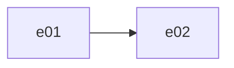

# Roadmap — <Project Title>

<One or two sentences: what the project is and why it is decomposed into these
epics. Point at `CHARTER.md` in this directory for the vision, stack decisions,
and boundaries every epic inherits.>

**Status legend**: planned · in-progress · done · deferred

| ID  | Epic | Intent | Scope boundary | Depends on | Status | PRD |
| --- | ---- | ------ | -------------- | ---------- | ------ | --- |
| E01 | <walking skeleton> | <one line> | In: <…> / Deferred: <…> | — | planned | — |
| E02 | <name> | <one line> | In: <…> / Deferred: <…> | E01 | planned | — |

## Flow graph
Include only when dependencies branch. Omit this section for a strictly
linear roadmap.

## Notes
How this file evolves: `spec` sets an epic `in-progress` at PRD approval and
fills the PRD column; `build` sets it `done` after the plan's final
verification. `blueprint` re-plans the remainder on request: it updates this
file first, then the affected PRDs. IDs are immutable once referenced; scope
shifts defer to a sibling epic, they never delete a row.